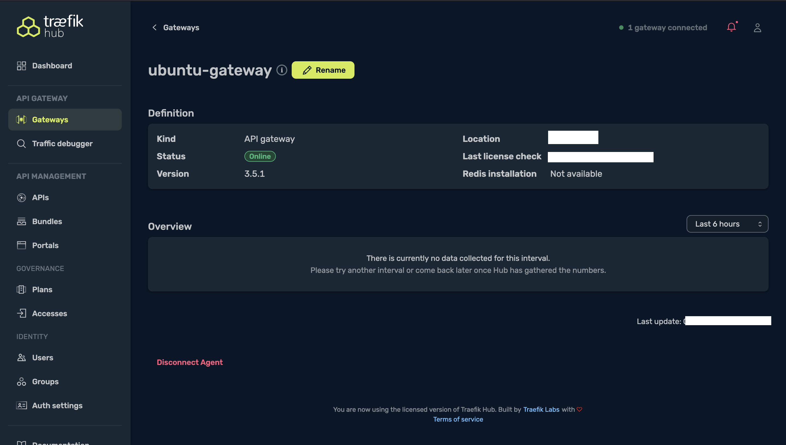
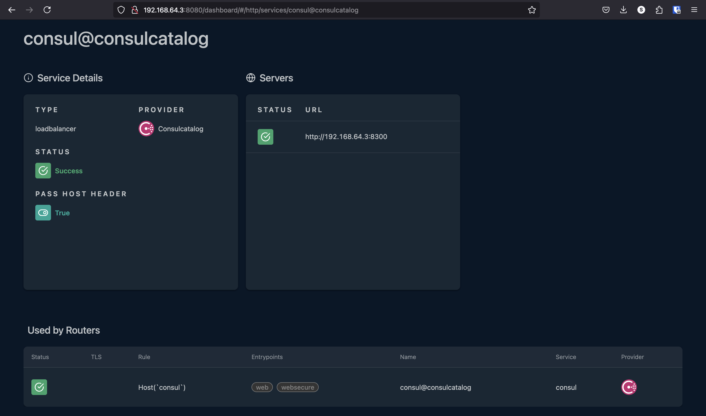
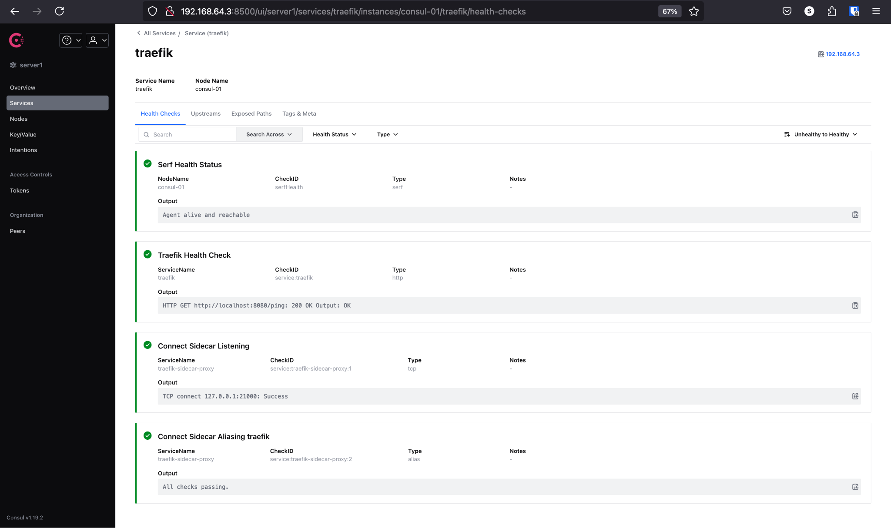
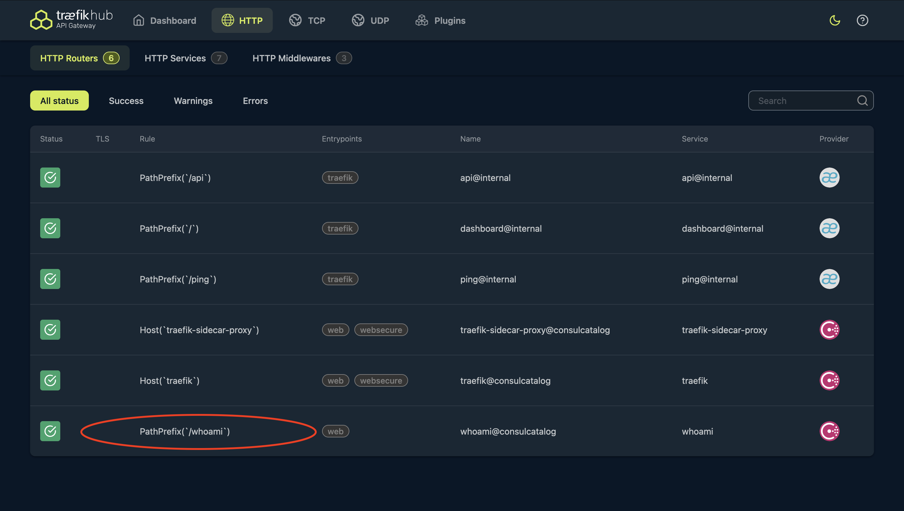

# Traefik Hub + Consul Connect

How to use Traefik Hub with Consul Connect on an Ubuntu Linux virtual machine (VM).

## Prerequisite

To follow along in this tutorial, we will need:

- A Linux machine running Ubuntu. For this tutorial, we are using [Multipass](https://multipass.run/) to orchestrate an Ubuntu Focal VM.
- [systemd](https://en.wikipedia.org/wiki/Systemd)
- [Latest Traefik Hub binary](https://github.com/traefik/hub/releases)
- [Consul](https://developer.hashicorp.com/consul/install#linux)

All config files are in the [public GitHub repository](https://github.com/traefik-workshops/traefik-hub-consul-connect) that accompany this article, so we just have to clone it:

```sh
git clone https://github.com/traefik-workshops/traefik-hub-consul-connect.git
cd traefik-hub-consul-connect
```

## Setting Up Traefik Hub on Linux

First, we will install Traefik Hub on Linux. We can do this by following the instructions in the [official Traefik Hub documentation](https://doc.traefik.io/traefik-hub/api-gateway/setup/linux/installation).

Here is the `traefik-hub.toml` file:

```toml :files/traefik-hub-intro.hcl
[hub]
  token = "YOUR_HUB_TOKEN"

[entryPoints]
  [entryPoints.web]
  address = ":80"

  [entryPoints.websecure]
  address = ":443"
[log]
  level = "INFO"
  filePath = "/var/log/traefik-hub.log"

# Enable API and dashboard
[api]
  dashboard = true
  insecure = true

# Enable ping
[ping]

[accesslog]
  addInternals = true
```

Once we have successfully installed Traefik Hub, run the following command to check that Hub started correctly.

```sh
sudo systemctl status traefik-hub.service
```

```sh
● traefik-hub.service - Traefik Hub
  Loaded: loaded (/etc/systemd/system/traefik-hub.service; enabled; vendor preset: enabled)
  Active: active (running) since Tue 2024-10-08 09:29:22 WAT; 2s ago
   Main PID: 1528 (hub)
    Tasks: 6 (limit: 1084)
  Memory: 28.1M
  CGroup: /system.slice/traefik-hub.service
         └─1528 /usr/local/bin/hub --configfile=/etc/traefik-hub/traefik-hub.toml

Oct 08 09:29:22 scholarly-crossbill systemd[1]: Started Traefik Hub.
```

>[!NOTE]
> We can get the hub token and hub platform url by creating a new Gateway for Linux on the [Traefik Hub Online Dashboard](hub.traefik.io) and following the installation instructions.

If we enable the dashboard and we navigate to `<server-ip>:8080/dashboard/` in the host machine browser, we should see the Traefik Hub Dashboard.


And if we head over to the Traefik Hub online dashboard, we should also see that the gateway status is online.



## Integrating Traefik Hub with Consul Connect

[Consul Connect](https://www.consul.io/docs/connect?ref=traefik.io) is a proxy layer that routes all service-to-service traffic through an encrypted and authenticated (Mutual TLS) tunnel.

Traefik Hub needs the [Consul Catalog provider](https://doc.traefik.io/traefik/providers/consul-catalog/) to interact with Consul services.

### Step 1: Modify the traefik-hub.toml file to include the Consul Catalog provider

Run the following command to access the `traefik-hub.toml` file

```sh
sudo nano /etc/traefik-hub/traefik-hub.toml
```

Add the Consul Catalog provider to the bottom of the file:

```toml
[providers.consulCatalog]
  exposedByDefault = false
  connectAware = true
  prefix = "traefik"
  [providers.consulCatalog.endpoint]
      address = "127.0.0.1:8500"
```

Restart Traefik Hub:

```sh
sudo systemctl restart traefik-hub.service
```

If we head over to the local dashboard, we should see the consul catalog provider in the services section:



### Step 2: Configure Consul Services for Traefik Hub

Register Traefik Hub with Consul by creating a new traefik-hub.hcl file:

```sh
sudo touch /etc/consul.d/traefik-hub.hcl
```

Add the following content:

```HCL :files/traefik-hub.hcl
service {
  name = "traefik"
  port = 80
  connect {
    sidecar_service {}
  }
  tags = ["traefik.enable=true"]
  check {
    name     = "Traefik Health Check"
    http     = "http://localhost:8080/ping"
    interval = "10s"
    timeout  = "1s"
  }
}
```

Reload Consul:

```sh
Consul reload
```

Next we need to Install Envoy Proxy as Consul Connect uses Envoy as the default sidecar proxy.

[Install Envoy on Ubuntu](https://www.envoyproxy.io/docs/envoy/latest/start/install#install-envoy-on-debian-based-linux):

```sh
wget -O- https://apt.envoyproxy.io/signing.key | sudo gpg --dearmor -o /etc/apt/keyrings/envoy-keyring.gpg

echo "deb [signed-by=/etc/apt/keyrings/envoy-keyring.gpg] https://apt.envoyproxy.io focal main" | sudo tee /etc/apt/sources.list.d/envoy.list

sudo apt-get update

sudo apt-get install envoy

envoy --version
```

After installing Envoy, we need to start the Consul Connect sidecar proxy for Traefik Hub by running the following command:

```sh
consul connect proxy -sidecar-for traefik &
```

```sh
==> Consul Connect proxy starting...
 Configuration mode: Agent API
     Sidecar for ID: traefik
           Proxy ID: traefik-sidecar-proxy

==> Log data will now stream in as it occurs:

 2024-10-08T15:23:55.563+0100 [INFO]  proxy: Proxy loaded config and ready to serve
 2024-10-08T15:23:55.564+0100 [INFO]  proxy: Parsed TLS identity: uri=spiffe://8e89a024-7f37-ac2b-8b47-c81f9d755dbb.consul/ns/default/dc/server1/svc/traefik
 2024-10-08T15:23:55.564+0100 [INFO]  proxy: Starting listener: listener="public listener" bind_addr=0.0.0.0:21000
```

We are doing this because In Consul Connect, services communicate through local Envoy sidecar proxies. Traffic between services is routed through these proxies, enabling mTLS encryption and enforcing service mesh policies.

To further simplify things and allow us run the proxy in the background, we can also create a service to run the sidecar proxy for Traefik by creating a `/etc/systemd/system/traefik-sidecar-proxy.service` and paste the following content in it:

```ini :files/traefik-sidecar-proxy.service
[Unit]
Description=Consul Connect Sidecar Proxy for Traefik Hub
Requires=traefik-hub.service
After=network-online.target traefik-hub.service
Wants=network-online.target

[Service]
Restart=on-failure
ExecStart=/usr/local/bin/consul connect proxy -sidecar-for traefik
User=root
Group=root

[Install]
WantedBy=multi-user.target
```

Apply the new service configuration:

```sh
sudo systemctl daemon-reload
```

Start the service

```sh
sudo systemctl start traefik-sidecar-proxy.service
```

Now, If we head over to the consul dashboard, we should see the `traefik` service running.


Further inspecting the `traefik` service in the dashboard, it should show us that all the checks passed for the service.



## Testing the Integration

In this section, we’ll:

- Install [whoami](https://github.com/traefik/whoami/releases/download/v1.10.3/whoami_v1.10.3_linux_amd64.tar.gz) as a service

- Register the service with Consul.

- Expose the service through Traefik Hub.

- Verify that everything is working as expected.

### Step 1: Download and install the whoami binary

Download the whoami binary:

```sh
wget https://github.com/traefik/whoami/releases/download/v1.10.3/whoami_v1.10.3_linux_amd64.tar.gz
```

>[!NOTE]
> Replace *linux_amd64* with your system architecture if necessary (e.g., linux_arm64 for ARM-based systems).

Extract the Binary:

```sh
tar -xvf whoami_v1.10.3_linux_amd64.tar.gz
```

Move the Binary to `/usr/local/bin/`:

```sh
sudo mv whoami /usr/local/bin/
```

Make the Binary Executable:

```sh
sudo chmod +x /usr/local/bin/whoami
```

### Step 2: Create a Systemd Service for whoami

Setting up whoami as a systemd service ensures it starts on boot and can be managed easily.

Create the Service File:

```sh
sudo nano /etc/systemd/system/whoami.service
```

Add the following content to the file:

```ini :files/whoami.service
[Unit]
Description=Whoami Service
After=network-online.target
Wants=network-online.target systemd-networkd-wait-online.service

[Service]
Restart=on-abnormal
User=root
Group=root
ExecStart=/usr/local/bin/whoami --port 8081
PrivateTmp=true
ProtectHome=true
ProtectSystem=full
CapabilityBoundingSet=CAP_NET_BIND_SERVICE
AmbientCapabilities=CAP_NET_BIND_SERVICE
NoNewPrivileges=true

[Install]
WantedBy=multi-user.target
```

Reload Systemd Daemon:

```sh
sudo systemctl daemon-reload
```

Enable and Start the whoami Service:

```sh
sudo systemctl enable whoami
sudo systemctl start whoami
```

Check the Status of the Service:

```sh
sudo systemctl status whoami
```

```sh
● whoami.service - Whoami Service
  Loaded: loaded (/etc/systemd/system/whoami.service; enabled; vendor preset: enabled)
  Active: active (running) since Wed 2024-10-09 12:10:59 WAT; 2s ago
   Main PID: 1887 (whoami)
    Tasks: 3 (limit: 1084)
 Memory: 980.0K
 CGroup: /system.slice/whoami.service
         └─1887 /usr/local/bin/whoami

Oct 09 12:10:59 scholarly-crossbill systemd[1]: Started Whoami Service.
Oct 09 12:10:59 scholarly-crossbill whoami[1887]: 2024/10/09 12:10:59 Starting up on port 80
```

Ensure the service is active and running.

>[!NOTE]
>Make sure that the whoami service is not running on the same port as Traefik Hub or another service, this can cause it to fail.

### Step 3: Register the whoami Service with Consul

We need to create a Consul service definition for whoami so that it can be discovered by Traefik Hub via the Consul Catalog provider.

Create the Consul Service definition:

```sh
sudo nano /etc/consul.d/whoami.hcl
```

Add the following content to the file:

```HCL :files/whoami.hcl
service {
  name = "whoami"
  port = 8081
  connect {
      sidecar_service {}
  }
  tags = ["traefik.enable=true"]
  check {
      name = "Whoami Health Check"
      http = "http://localhost:8081/api"
      interval = "10s"
      timeout  = "1s"
  }
}
```

Save the file and reload the Consul configuration:

```sh
consul reload
```

### Step 4: Start the Consul Connect Sidecar Proxy for whoami

The sidecar proxy handles secure communication within the service mesh.

Start the Sidecar Proxy:

```sh
consul connect proxy -sidecar-for whoami &
```

> [!NOTE]
> To make things easier, we can also run the sidecar proxy as a service by following the steps we used for the Traefik Hub sidecar proxy service and adding the following content:

```ini :files/whoami-sidecar-proxy.service
[Unit]
Description=Consul Connect Sidecar Proxy for Whoami
Requires=whoami.service
After=network-online.target whoami.service
Wants=network-online.target

[Service]
Restart=on-failure
ExecStart=/usr/local/bin/consul connect proxy -sidecar-for whoami
User=root
Group=root

[Install]
WantedBy=multi-user.target
```

If we head over to our Consul dashboard, we should see the whoami service registered.


### Step 5: Configure Traefik Hub to Expose the whoami Service

Next, we’ll need to update our Consul whoami service configuration to enable Traefik Hub to route traffic to the whoami service.

Update the tags in the `whoami.hcl` file with the following:

```HCL
tags = [
  "traefik.enable=true",
  "traefik.http.routers.whoami.rule=PathPrefix(`/whoami`)",
  "traefik.http.routers.whoami.entrypoints=web",
  "traefik.http.middlewares.whoami-stripprefix.stripPrefix.prefixes=/whoami",
  "traefik.http.routers.whoami.middlewares=whoami-stripprefix",
  "traefik.consulcatalog.connect=true"
  ]
```

> [!NOTE]
> Alternatively, we can also include `connectByDefault = true` to the static configuration if we want Traefik Hub to automatically connect to all consul services.

Reload Consul:

```sh
consul reload
```

If we head over to the Traefik Hub local dashboard, we should now see whoami as a route.



### Step 6: Test the integration

We can make a quick test to make sure that Traefik Hub is routing traffic appropriately.

If we run the following command:

```sh
curl -i localhost/whoami
```

We should get a similar result:

```sh
HTTP/1.1 200 OK
Content-Length: 462
Content-Type: text/plain; charset=utf-8

Hostname:
IP: 127.0.0.1
IP: ::1
IP: 192.168.64.3
IP: fdac:f919:570f:ce1c:5054:ff:fe87:f84e
IP: fe80::5054:ff:fe87:f84e
IP: 172.17.0.1
RemoteAddr: 127.0.0.1:41176
GET / HTTP/1.1
Host: localhost
User-Agent: curl/7.68.0
Accept: */*
Accept-Encoding: gzip
X-Forwarded-For: ::1
X-Forwarded-Host: localhost
X-Forwarded-Port: 80
X-Forwarded-Prefix: /whoami
X-Forwarded-Proto: http
X-Forwarded-Server:
X-Real-Ip: ::1
```

If we check the logs, we should see an entry for this request:

```sh
sudo journalctl -u traefik-hub -f
```

```sh
Oct 09 15:55:43 scholarly-crossbill systemd[1]: Started Traefik Hub.
Oct 09 16:14:35 scholarly-crossbill hub[3944]: ::1 - - [09/Oct/2024:15:14:35 +0000] "GET /whoami HTTP/1.1" 200 462 "-" "-" 1 "whoami@consulcatalog" "https://192.168.64.3:21001" 61ms
```
